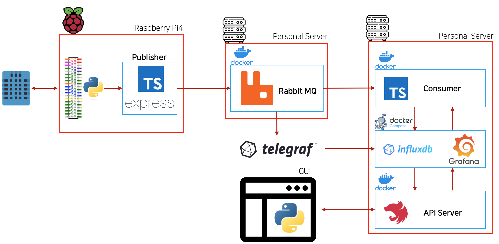
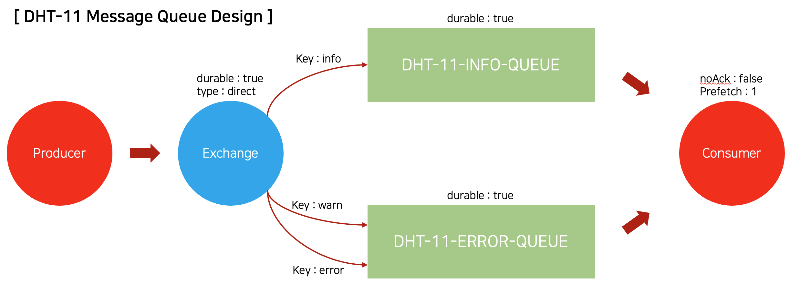
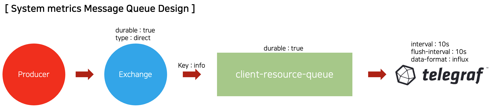
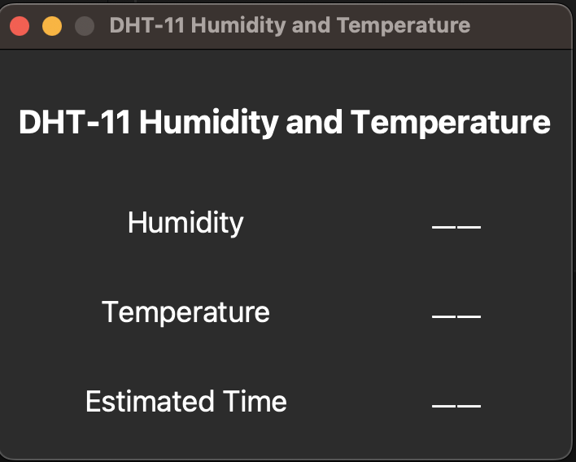
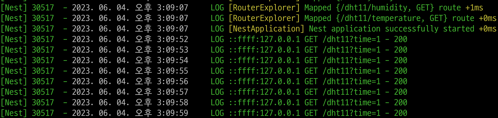
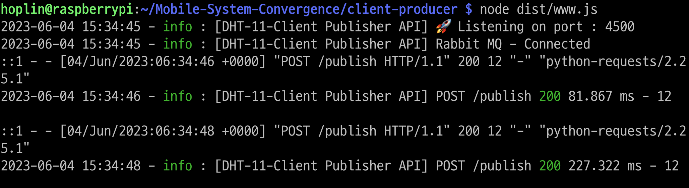
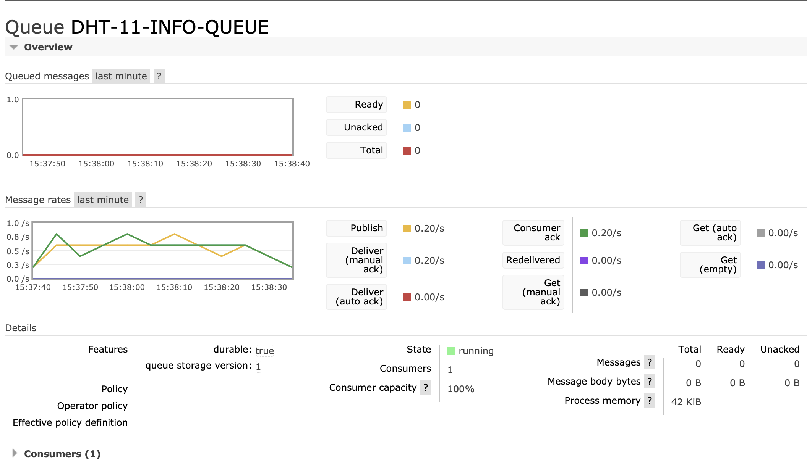
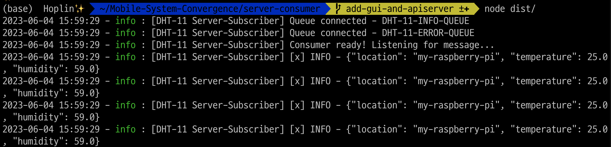
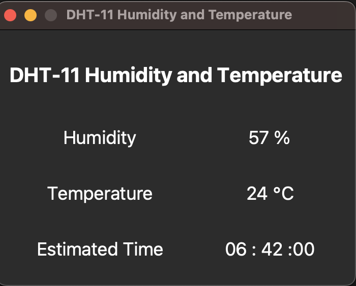
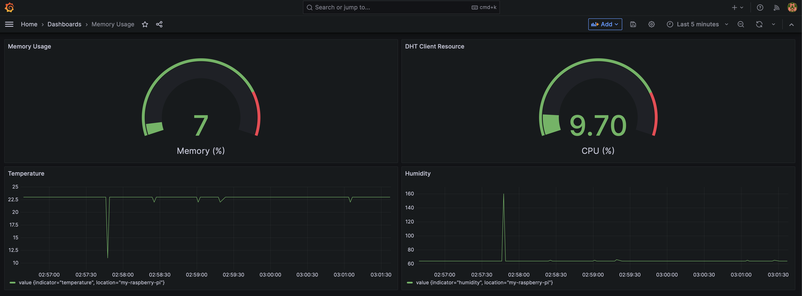

# Mobile System Convergence final project

---

**This document do not provide a package installation method such as tkinter or etc. Please install it on your own. Make an issue if something is wrong or not working on process**

## System Block Diagram



## Message Queue Design





**Require 3 computers to make experiment including Raspberry Pi4**

1. Raspberry Pi 4B

- 4GB of RAM

- Role of `Publisher`

- Need to install
  - Node.js v18+
  - Docker(Optional)

2. Synology NAS DS 720+

- Intel Celeron, with 10GB of RAM

- Role of `Rabbit MQ Server`

- Need to install
  - Docker

3. Mac mini

- Apple Silicon, 16GB of RAM
- Role of `Consumer`
- Need to install
  - Python
  - Node.js v18+
  - Docker
  - Docker-Compose

## Skills used in the design

### Programming Language

- Node.js
  - Pakcage manager : yarn
- TypeScript
- Python3
  - Runtime : Anaconda

### Framework

- TypeScript + Express.js
- Nest.js

### Infrastructure

- Platform : Raspberry Pi4
- Docker
- Docker-Compose
- Message Queue : Rabbit MQ
- Influx DB
- Grafana
- Telegraf

## Order of execution

### 1. Rabbit MQ Setting

Execute `Rabbit MQ` docker in Rabbit MQ Server. I recently made Rabbit MQ tutorial contents with Node.js. So if you need those information, please follow this [link].(https://github.com/J-hoplin1/RabbitMQ-R-n-D)

```
sudo docker run -d --name rabbitmq -p 5672:5672 -p 15672:15672 -p 1883:1883 -e RABBITMQ_DEFAULT_USER=user -e RABBITMQ_DEFAULT_PASS=password rabbitmq:3-management
```

After execute docker container of rabbit mq you need to edit `.env` file of both client-side and server-side

- [Client's envfile : client-producer/env/.env](./client-producer/env)

  ```
  # Connection information
  MQ_NAME=(Rabbit MQ username)
  MQ_PASSWORD=(Rabbit MQ user password)
  MQ_HOST=(Rabbit MQ Server Host)
  MQ_PORT=(Rabbit MQ Port of server)

  ...
  ```

- [Server's envfile : server-dotenv/.env](./server-dotenv/)

  ```
  # Connection information
  MQ_NAME=(Rabbit MQ username)
  MQ_PASSWORD=(Rabbit MQ user password)
  MQ_HOST=(Rabbit MQ Server Host)
  MQ_PORT=(Rabbit MQ Port of server)

  ...
  ```

### 2. Server setting

First you need to start `InfluxDB - Grafana` docker compose located in [here](./server-influx-grafana-compose/). If you want to use telegraf also, please follow this [document](./docs/telegraf-settings.md).

```
cd ./server-influx-grafana-compose

docker compose up -d
```

Please refer to this [page](./docs/influx-grafana-setting.md) to make setting of `InfluxDB - Grafana`

After setting `InfluxDB - Grafana` start `Consumer` and `API Server` and `Monitoring GUI` in order.

- [Server Consumer](./server-consumer/)

  ```
  cd server-consumer/

  yarn install

  yarn tsc

  node dist/
  ```

- [API Server](./server-api-server/)

  ```
  cd server-api-server/

  yarn install

  yarn run start
  ```

  Connect to `localhost:3000/docs` in server machine browser for API endpoints documet

  ```
  localhost:3000/docs
  ```

- [Monitoring GUI](./monitoring-gui/)

  ```
  cd monitoring-gui/

  python3 app.py
  ```

  It's normal that no data appears
  

If it's normally executed, Monitoring GUI will request to API server per second



### 3. Client setting

**Client should be Raspberry Pi4.** Make an DHT 11 sensor connection. Follow picture under below


and install Adafruit Python DHT. Follow the instructions on this [github](https://github.com/adafruit/Adafruit_Python_DHT)

Check sensor connected to gpio by executing [`client-DHT11/app.py`](./client-DHT11/app.py)

```
python3 app.py
```

If it's normal temperature, humidity sensor should be estimate. Don't care about `Connection error occured. Please check API Server` message.

Next we need to execute REST API based producer.

```
cd client-producer/

yarn install

yarn tsc

node dist/www.js
```

Connect to `localhost:3000/docs` in client machine browser for API endpoints documet

```
localhost:3000/docs
```

If producer start normally it will publish message to rabbit mq


and rabbit mq will receive message and save to queue by routing key.



Server consumer will consume message



and save it as time-series data to influx db


finally you can view datas in realtime via monitoring GUI and grafana dashboard




### 4. Reason why I made producer as API type

Reason why I made producer as API type, is to reduce user dependence on programming languages, packages, and frameworks and module coupling when developing applications. Instead, using a protocol called http allows users to focus more on business logic by simply sending data to endpoints, and the source code they write does not need to be combined with source code that relies on message queue modules such as Rabbit mq.
