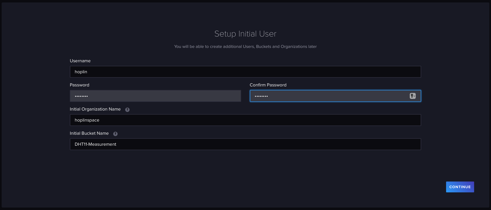
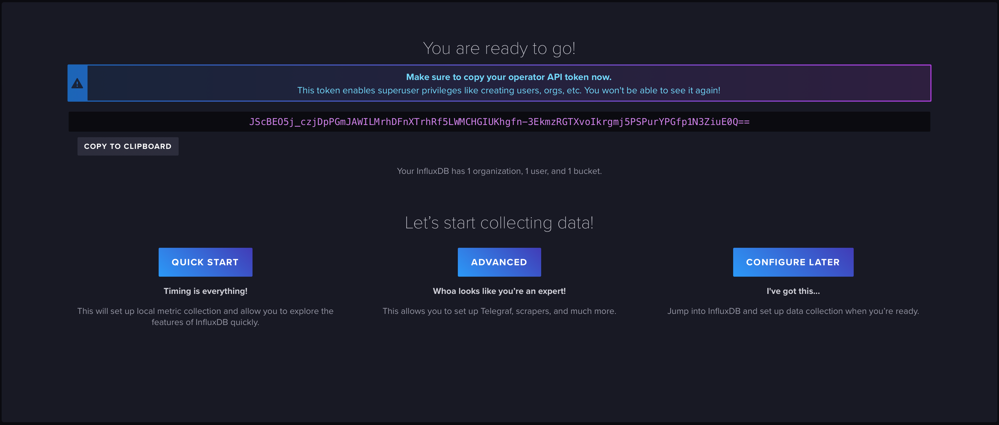
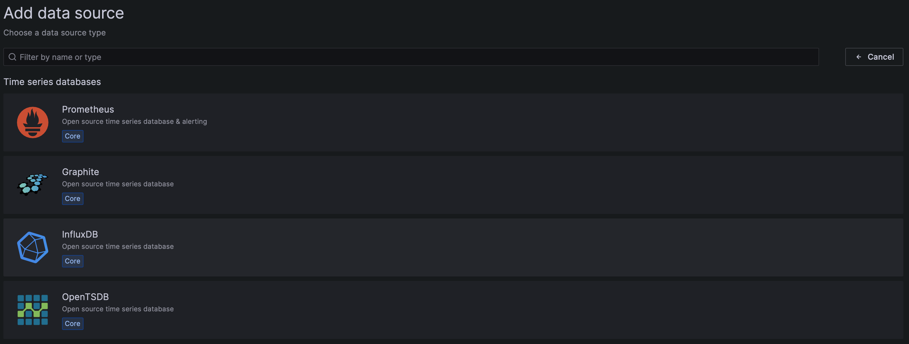
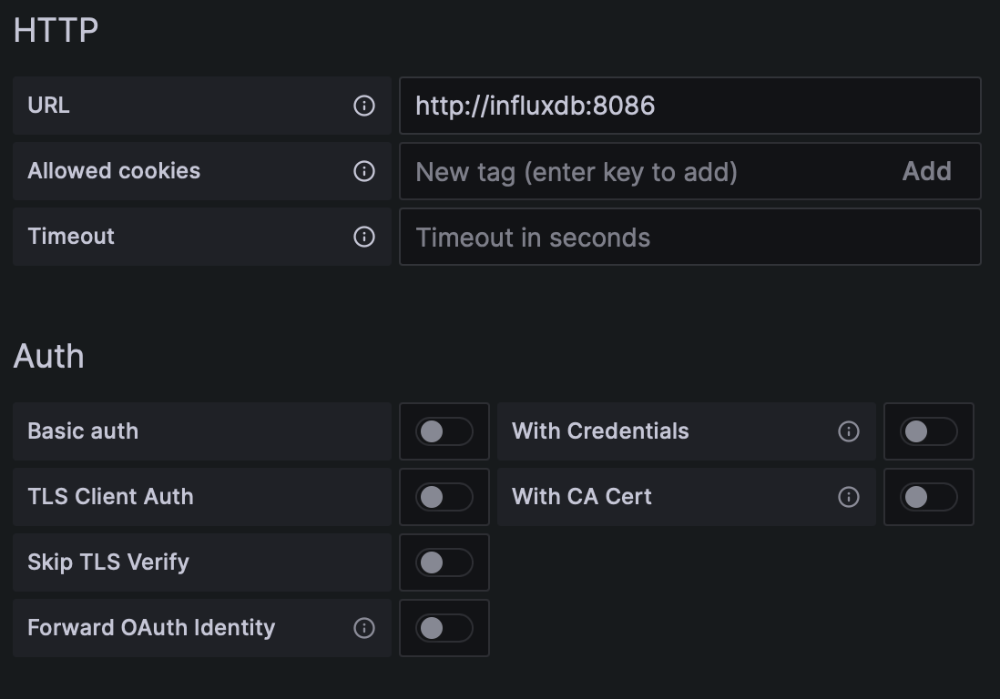
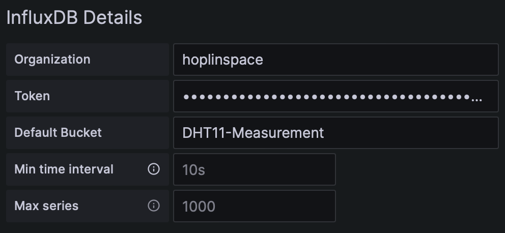
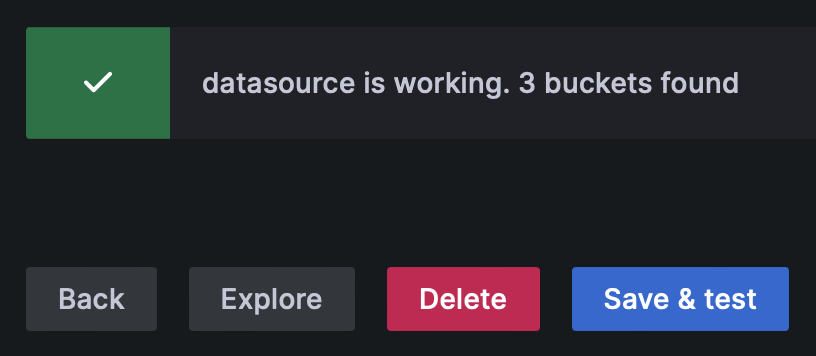
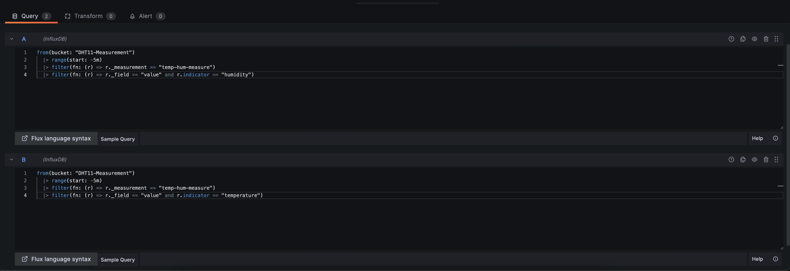

# InfluxDB Grafana Setting

---

1. After start your compose file, connect to `localhost:8086` and set initial informations and copy api token it give.

   

   

2. Edit server dotenv file located in [here](../server-dotenv/)

   ```
   # InfluxDB Config
   INFLUX_URL=(InfluxDB url)
   INFLUX_TOKEN=(InfluxDB API token)
   INFLUX_ORG = (InfluxDB Organization Name, can edit later via influxdb UI)
   INFLUX_BUCKET=(InfluxDB Organization Name, can edit later via influxdb UI)
   INFLUX_USERNAME=(InfluxDB user name, can edit later via influxdb UI)
   INFLUX_PASSWORD = (InfluxDB user password, can edit later via influxdb UI)
   ```

3. Connect to `localhost:6500` which is grafana UI. Do initial login and change password. Initial ID/PW is `admin/admin`

4. Go to `Administration - Data Source` and click `Add DataSource`. Select `Influx DB` of time series datbase

   

5. Do influx connection setting. Values using in this step is same with values you generated below. What you need to care is, we compose `InfluxDB - Grafana` with docker bridge network. So url should be name of influxdb's docker dns' name.

   

   

   
   After `Save & test`, if connection is successful it will give you message like picture below.

6. Initalize Dashboard. Go to `Dashboard - New Dashboard` and click `Add visualize`. And enter two influxql I have written.(Use your own query if you want to change). Copy default queries in [here](../server-influx-grafana-compose/grafana/). And click `apply`

   
