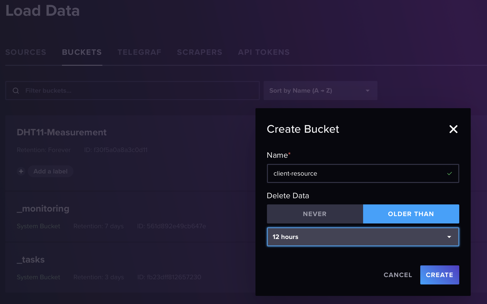
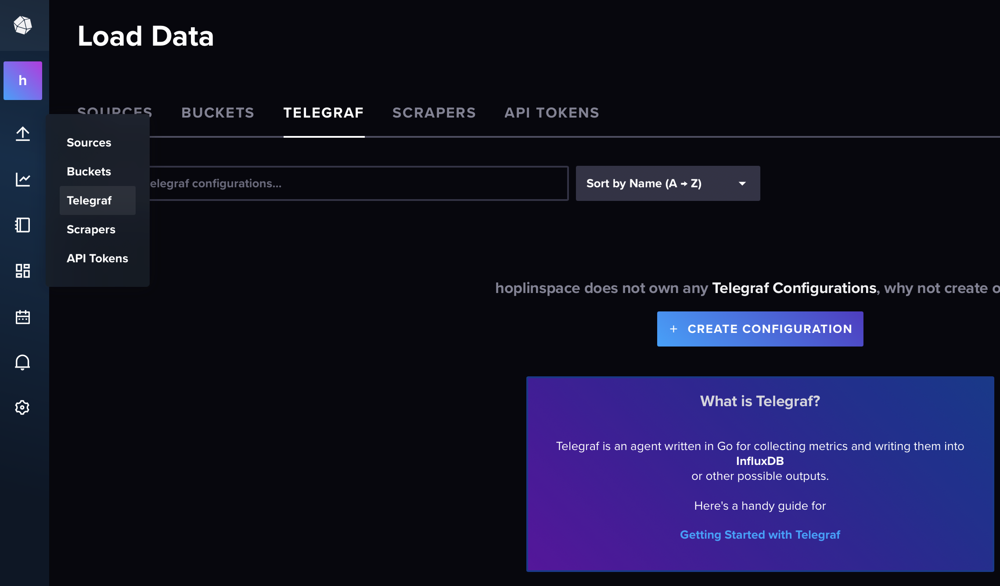
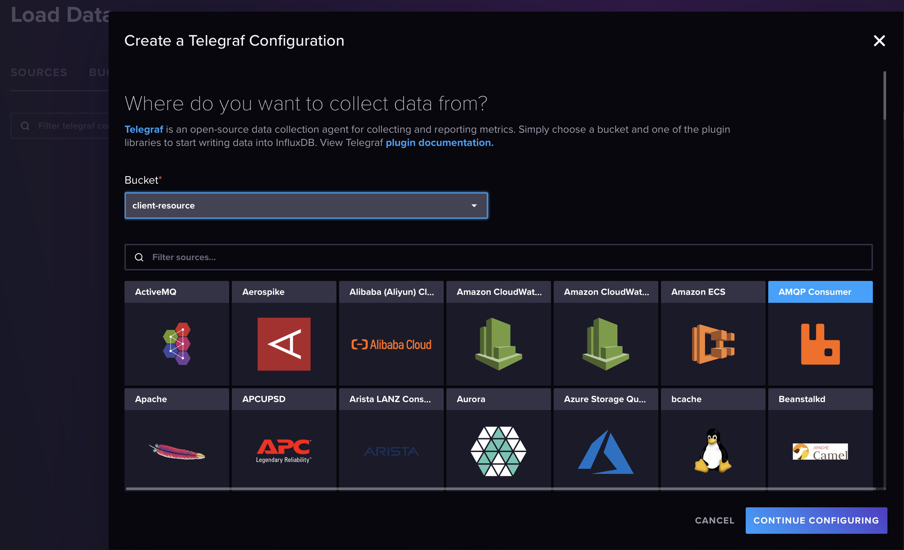
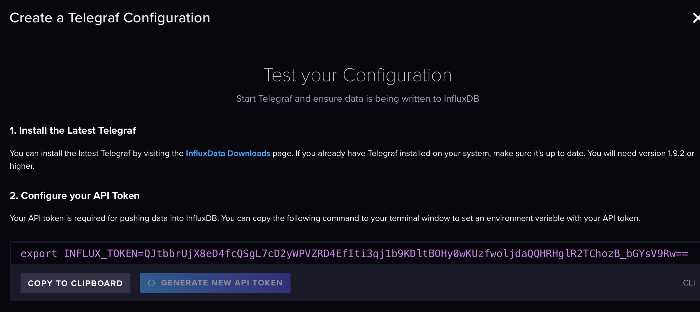

# Telegraf system resource metrics setting

In this repository, I made system metric logic using [telegraf](https://github.com/influxdata/telegraf).

- What is metric? : Matric refers to an event that contains a timestamp and usually one or two numeric values.Unlike logs, metrics occur periodically, usually when something happens, logs are recorded in log files, while metrics are events that occur periodically or collect.

- What is telegraf? : Telegraf is the open source server agent to help you collect metrics from your stacks, sensors, and systems.

Fistly, if you want to use telegaf you need to execute docker-compose as [server-influx-grafana-telegraf-compose](./server-influx-grafana-telegraf-compose/docker-compose.yaml) instead of docker-compose we used below.

Before start, please make setting of InfluxDB/Grafana through this [document](influx-grafana-setting.md).

## Telegraf configure

---

From now on, word `config-file` means **[telegraf.conf](../server-influx-grafana-telegraf-compose/telegraf/telegraf.conf)**

---

0. Set as your rabbit mq's connection string in config-file
   ```
   [[inputs.amqp_consumer]]
   brokers = ["(your connection string)"]
   ```

Connect to InfluxDB UI

1. Firstly create bucket for system metrics.
   

   You need to edit config-file's bucket, organization(which is organization you made in influxdb initial setting) first

   ```
   [[outputs.influxdb_v2]]

   ...

   ## Fix Here
   ## Organization is the name of the organization you wish to write to; must exist.
   organization = "(your value)"

   ## Fix Here
   ## Destination bucket to write into.
   bucket = "(your value)"

   ...
   ```

2. Go to telegraf tab, and click `Create Configuration`

   

3. Select bucket, which you made in step 1 for system metrics and select `AMQP Consumer` and continue

   

4. Ignore while API Token show in UI

   

   only copy API Token(string after `export INFLUX_TOKEN=`) and paste to your config-file

   ```
   [[outputs.influxdb_v2]]

   ## Fix Here
   ## Token for authentication.
   token = "(your value)"
   ```

5. Start **[app.py](../client-resource-publisher/)** in clinet(which is raspberry pi)

   ```
   python3 app.py
   ```

6. Restart telegraf container

   ```
   docker restart server-telegraf
   ```

7. InfluxQL for system matrics, used in grafana located in [here](../server-influx-grafana-telegraf-compose/grafana/)
